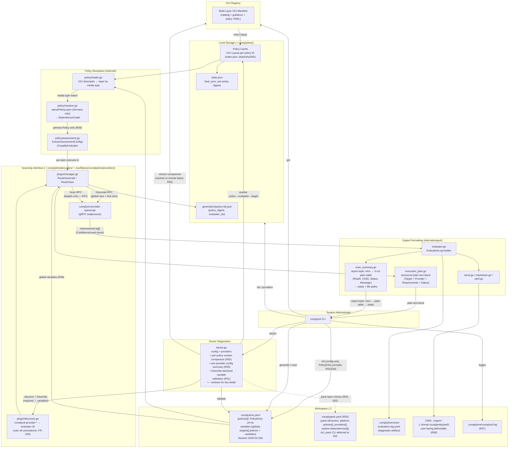

# Implementation Plan: Gemara-Native Decoupled Workflow

**Branch**: `001-gemara-native-workflow` | **Date**: 2026-02-14 (updated 2026-02-27) | **Spec**: [spec.md](./spec.md)
**Input**: Feature specification from `/specs/001-gemara-native-workflow/spec.md`

## Summary

Replace the legacy C2P/OSCAL workflow in complyctl with a Gemara-native decoupled workflow. Core changes: OCI registry-based policy fetch using `oras-go/v2` with zero custom auth (`oras-credentials-go`), gRPC scanning interface via `hashicorp/go-plugin`, policy graph resolution via `go-gemara`, and multi-format output (EvaluationLog, OSCAL, Markdown, SARIF). Each policy is a single multi-layer OCI manifest; layers identified by YAML media type (`+yaml`). Scanning provider subsystem simplified — no manifests, no checksums, no mock code in production. Per-assessment-plan evaluator routing supports heterogeneous policies with multiple evaluators (R32). `complyctl generate` persists artifacts with digest-based freshness tracking; `scan` auto-detects and reuses or regenerates (R34, R37). Three-tier variable model (R48): global variables (workspace-scoped, e.g., scan output directory), target variables (per-target runtime config like credentials/profile, passed during Scan RPC), and test variables (per-requirement parameters from decomposed Gemara policy, passed during Generate RPC). Replaces old `evaluator_config` concept. Scan RPC receives targets only — no `requirement_ids`; providers evaluate all requirements from Generate-time state (R47). Post-scan terminal output: report-style layout with 4-column plain text table (Requirement ID, Control ID, Status, Message) for non-passing results + compact inline totals (FR-037). Result aggregation delegates to go-gemara. All tabular outputs use plain aligned text (`ShowPlainTable`) — `lipgloss/table` dependency removed due to persistent emoji alignment issues across terminals (Session 2026-02-26e). No `--pretty` flag, no `--plain` flag. `charmbracelet/bubbles/table` removed. `generate` outputs a structured plain-text block (indented labeled lines per target-provider pair), not a table. `scan --dry-run` removed — `generate` is the only execution plan preview (Session 2026-02-26e). Log file at `.complytime/complyctl.log` (R57). Formatted reports (`--format oscal|pretty|sarif`) written to CWD; EvaluationLog stays in `.complytime/scan/` (R58). `complyctl doctor` for comprehensive pre-flight diagnostics (R44, FR-039); doctor validates required variables via Describe-declared `required_global_variables` and `required_target_variables` fields (R51). `complyctl init` is config-creation-only: creates `complytime.yaml` and exits (R54, supersedes R52/R50 composite orchestrator). User runs `get` and `doctor` separately. `complytime.yaml` uses `PolicyEntry` objects: each policy has a `url` (full OCI reference including registry) and an optional `id` (user-chosen shortname; auto-derived from last URL path segment if omitted). No `pack` field, no separate `registry` section — each policy URL is self-contained. Policies from different registries coexist. Targets reference policies by effective ID (Session 2026-02-25d, supersedes R54 dual-mode config). Pack builder is a separate tool — all pack CLI commands deferred to 002. `complytime.yaml` is a static convention like `go.mod` — no `--config` flag. Scan output directory centralized as `ScanOutputDir` constant (R42, FR-038).

**Terminology**: User-facing documentation uses "scanning providers" for individual evaluator executables and "scanning interface" for the gRPC contract they implement. Code-level packages (`pkg/plugin`, `internal/plugin`) retain `plugin` naming for compatibility with `hashicorp/go-plugin`. CLI command: `complyctl providers`.

## Data Flow Diagram



## Technical Context

**Language/Version**: Go 1.24
**Primary Dependencies**:
- `oras.land/oras-go/v2` v2.6.0 — OCI registry operations + OCI Layout cache
- `oras.land/oras-credentials-go` (latest) — Docker credential resolution (R6, R24)
- `github.com/gemaraproj/go-gemara` v0.0.1 — Gemara parsing/validation/result aggregation (R2)
- `github.com/hashicorp/go-plugin` v1.7.0 — gRPC scanning interface lifecycle (R4)
- `github.com/defenseunicorns/go-oscal` v0.7.0 — OSCAL output types (R3)
- `buf` CLI — protobuf codegen, linting, breaking-change detection (R5)

**Storage**: Local OCI Layout store (`~/.complytime/policies/{id}/`) via `oras-go/v2/content/oci` (R17)
**Testing**: `go test` with `testify/assert` + `testify/require`. Integration tests behind `//go:build integration`. E2E tests behind `//go:build e2e`. Test scanning provider binary at `cmd/test-plugin/`. Unit test requirements (Session 2026-02-26): all exported functions in `internal/policy/`, `pkg/plugin/discovery.go` MUST have positive + negative test cases. `internal/cache/state.go` covered indirectly by `sync_test.go`. Resolver tests use `PolicyLoader` interface mock — no OCI store dependency. Policy layer parsing tested with synthetic YAML stubs (no upstream go-gemara fixtures). Plugin discovery tests use real temp directories with mock executables (no interface abstraction).
**Target Platform**: Linux/macOS CLI (cross-compiled via `go build`)
**Project Type**: Single CLI application with gRPC scanning provider architecture
**Performance Goals**: Deferred — SC-001 through SC-007 are aspirational (R14)
**Constraints**: Zero custom auth code (R6, R24). All mock implementations in `_test.go` files only. Parameter overrides validated against accepted values at generate time (R23). Each policy is a single multi-layer OCI manifest with YAML content (R25, R27). Flat repo path mapping — policy ID = OCI repo name (R26). Proto package stays at `complyctl.plugin.v1` — pre-release breaking changes allowed (R29).

**Session 2026-02-23 Changes**:
- `Confidence` field changed from `double` (0.0-1.0) to `ConfidenceLevel` enum mirroring go-gemara: `NOT_SET`, `UNDETERMINED`, `LOW`, `MEDIUM`, `HIGH` (R29)
- OpenSCAP scanning provider: `oscalPolicy` global variable and `policytype` package deleted; all tailoring/scan functions refactored to use `[]plugin.AssessmentConfiguration` (R30)
- Two parameter categories distinguished: Parameters (test config from Layer 3 Gemara policy, via `AssessmentConfiguration.parameters` in Generate RPC) and Vars (provider-specific runtime config, via `Target.variables` in Scan RPC). ~~Vars not advertised via protocol — documented out-of-band only (R31)~~ (superseded R51: providers declare required variable *names* via `HealthCheckResponse`; doctor validates)

**Session 2026-02-23b Changes (Spec Clarifications)**:
- Per-assessment-plan evaluator routing: each plan's `evaluation-methods[].executor.id` determines the scanning provider. Multi-evaluator policies dispatch to N providers (R32)
- `complyctl providers` command added: top-level command showing discovered scanning providers (R33)
- `complyctl generate` stays as `generate`; persists artifacts + records policy cache digest; outputs structured plain-text execution plan (R34 updated, R37, Session 2026-02-26e)
- `complyctl scan` is smart about generation: auto-generate if no artifacts, reuse if fresh, warn+regenerate if stale (R37)
- ~~`complyctl scan --dry-run` provides pre-flight preview without executing checks (FR-033)~~ (removed Session 2026-02-26e — `generate` is the only plan preview)
- `complyctl scan` prints brief one-line summary before scanning (FR-034)
- ~~Execution plan format: two tables — evaluator-to-requirements and target-to-policy (R36)~~ (superseded: structured plain-text block, Session 2026-02-26e)

**Session 2026-02-23c Changes (Spec Clarifications)** *(partially superseded by R57)*:
- ~~All tabular CLI outputs use charmbracelet rendering (R38)~~ (superseded R57: plain default, `--pretty` for lipgloss). `internal/terminal` package provides both renderers.
- ~~`--plain` flag extends only to discovery commands~~ (superseded R57: plain is default, `--plain` removed, `--pretty` added).
- `parsePolicyLayer` accepts only `gemara.Policy` with `adherence.assessment-plans` (R39). Fail fast on invalid YAML.

**Session 2026-02-23d Changes (Spec Clarifications)**:
- Two-tier terminal output (FR-035, R40): **Tier 1** (`init`, `get`) shows real-time progress via `fmt.Fprintf(os.Stderr, ...)`. **Tier 2** (`list`, `providers`, `generate`, `scan`, `doctor`) shows summary/table output via `fmt.Print` to stdout.
- Pre-dispatch validation (FR-036, R41): Validates workspace configuration before Generate RPC dispatch. Global variables must be present for required fields. Provider configuration errors enhanced with evaluator ID and config path context.

**Session 2026-02-25e Changes (Doctor Redesign — Version Comparison + Per-Provider Config)**:
- **Doctor registry check replaced (R55)**: Reachability-only probe replaced by per-policy version comparison. Doctor compares cached policy versions against latest available remotely. Non-blocking warning per stale policy (e.g., `⚠️ policy/nist-r5: cached v1.0.0, available v1.1.0 — run complyctl get to update`). Pass per up-to-date policy (e.g., `✅ policy/nist-r5: v1.0.0 (latest)`). Non-blocking warning per unreachable registry (e.g., `⚠️ registry/X: unreachable — version check skipped`) — policies from that registry get no staleness line. Supersedes FR-039 reachability check.
- **Per-provider config summary (R55)**: Default output shows resolved variable count + missing count per provider (e.g., `✅ provider/openscap: 3/3 global vars, 2/2 target vars`). `--verbose` flag expands to full list of expected keys and resolved status per provider. Supersedes validation-only output (failures-only).
- **`--verbose` flag scoped (R55)**: Expands per-provider variable detail only. Version comparison stays per-policy summary always. Policy evaluation periods (active start/end dates) are a future `--verbose` candidate when go-gemara exposes validity period fields.

**Session 2026-02-24 Changes (Spec Clarifications — Updated)**:
- `complyctl doctor` command (FR-039, R44, R51, R55): Comprehensive pre-flight diagnostics. Checks: config syntax, provider discovery + HealthCheck, per-policy version comparison (non-blocking, supersedes reachability-only probe — R55), per-provider config summary with resolved/missing counts (R55), HealthCheck-declared required variable validation (R51). Requires policy cache for target variable mapping (R52). Supports `--verbose` flag for per-provider variable detail (R55). Emoji + message output.
- Post-scan summary redesigned (FR-037, R45): ActionError-style. Non-passing results as emoji + message lines. Single-row charmbracelet totals table. Message from `AssessmentLog.Steps[].Message`. Result aggregation via go-gemara.
- Workspace artifact directory constants (FR-038, R42): `WorkspaceDir = ".complytime"` (workspace-local artifact root) and `ScanOutputDir = "scan"` (scan output subdirectory) in `internal/complytime/consts.go`. All workspace-local paths (generation state, scan output) use `WorkspaceDir` as root.
- Terminology shift (R46): "scanning providers" and "scanning interface" in user-facing docs. Code packages retain `plugin`.
- **Targets-only Scan RPC (R47)**: `requirement_ids` removed from `ScanRequest`. Scanning provider evaluates all requirements from its Generate-time state. Scan RPC receives only targets (target ID + target variables). Simplifies proto contract and eliminates drift risk between Generate-configured and Scan-requested requirements.
- **Three-tier variable model (R48)**: Replaces `evaluator_config`. (1) Global variables — workspace-scoped config in top-level `variables` section of `complytime.yaml` (e.g., `workspace: ./.complytime/scan`). Passed to providers during Generate RPC. (2) Target variables — per-target runtime config under `targets[].variables` (credentials, profile, kubeconfig). Passed to providers during Scan RPC. (3) Test variables — per-requirement parameters from decomposed Gemara policy assessment plan. Extracted during policy resolution, passed during Generate RPC. Clean separation of concerns: Generate = what + how (global + test vars); Scan = where + with what (target vars).
- **Global variables config location (R49)**: Top-level `variables` section in `complytime.yaml`. Not under PolicyEntry or TargetConfig. Config structure: `policies` ([]PolicyEntry) + `variables` (global) + `targets[].policies` + `targets[].variables` (per-target). No separate `registry` section — each policy URL is self-contained (Session 2026-02-25d).

**Session 2026-02-23g Changes (Spec Clarifications)**:
- **HealthCheck required variables (R51)**: `HealthCheckResponse` gains `repeated string required_global_variables` and `repeated string required_target_variables`. Doctor validates declared variable names against workspace config sections. Supersedes R31 ("vars not advertised via protocol") and R41 ("plugin advertises required config keys: adds protocol complexity"). Proto3 backward compatible — old providers return empty lists.
- **Init flow reordering (R52)**: `init` phases become create config → `get` → `doctor` (was create config → `doctor` → `get`). Doctor requires policy cache to resolve policy → evaluator → target mapping for target variable validation. Standalone `doctor` requires cache to exist. Supersedes R50 phase ordering.
- **Doctor variable validation (FR-039 updated)**: Check (5) rewritten from vague "global variables present if configured" to concrete HealthCheck-driven validation: global keys checked against `config.variables`, target keys checked against relevant `config.targets[].variables` using policy → evaluator → target mapping.

**Session 2026-02-23e Changes (Spec Clarifications)** *(partially superseded by R54)*:
- ~~`complyctl init` redesigned as composite orchestrator (R50)~~ (superseded R54: init is config-creation-only). Errors if `complytime.yaml` already exists (like `go mod init`, unchanged).
- `complytime.yaml` is a static convention like `go.mod`. No `--config` flag on any command. CI/CD path: commit `complytime.yaml` to repo, run `complyctl get` and `complyctl doctor` directly.
- `LoadFrom(path)` added to `config.go`; `Load()` delegates to it. Validation removed from `LoadFrom` — callers validate explicitly. `get`, `generate`, `scan`, `list` call `Validate()` after load.
- `doctor.CheckConfig` now runs full validation pipeline: `LoadFrom()` + `Validate()` + `ValidateTargetPolicyVersions()`. Target-policy cross-reference checking moved from `init` to `doctor`.

**Session 2026-02-25b Changes (Comply-Packs — deferred to 002-comply-packs)**:
- **Comply-pack config separation (R53)**: Two config files with distinct ownership. `complypack.yaml` (pack manifest) declares what a comply-pack contains — developer-owned, immutable after build, ships in the pack. `complytime.yaml` (runtime config) declares how to run — consumer-owned, mutable per-environment, does NOT ship in the pack. The pack ships a `complytime.yaml.example` as a starter template. `doctor` reads both files when both exist.
- **`complypack.yaml` schema**: `id`, `version`, `description`, `platform` (os + datastream), `registry`, `policies[]` (PackPolicyEntry with id/version/profile/catalog/source), `providers[]` (PackProviderEntry with id/binary/source), `system-dependencies[]` (name/check/install). No targets, no variables, no credentials.
- **`complytime.yaml` in pack context**: Identical to existing `WorkspaceConfig` (R8, R48, R49). `registry.url` optional (policies pre-cached). `policies[]` may be subset of pack. `targets[]` and `variables{}` fully consumer-controlled.
- **Doctor dual-file mode**: If `complypack.yaml` present, doctor validates pack-layer checks (manifest schema, provider binaries, cache digests, system deps via `check` commands) plus config-layer checks from `complytime.yaml` (target-policy bindings, variable resolution). If absent, standalone mode (existing behavior).
- **Fedora comply-pack inventory**: 5 policies from ComplianceAsCode/oscal-content — `cis-fedora-l1-server`, `cis-fedora-l1-workstation`, `cis-fedora-l2-server`, `cis-fedora-l2-workstation`, `cusp-fedora-default`.
- **Pack distribution**: `complyctl pack push/pull` via OCI artifacts. Pack build output: tarball with `complypack.yaml`, `bin/complyctl`, `bin/complyctl-provider-*`, `policies/*/` (OCI layouts), `complytime.yaml.example`.
- **Implementation**: ~~`complyctl pack init` (create `complypack.yaml`) moved to 001 scope (R54)~~ (superseded Session 2026-02-25d: all pack CLI commands deferred to 002). Remaining `pack` subcommands (`pack doctor`, `pack build`, `pack push`, `pack pull`) deferred to `002-comply-packs` branch. Core runtime from 001 must be complete first. See `docs/COMPLY_PACK_QUICKSTART.md` for design validation.

**Session 2026-02-25c Changes (Spec Clarifications — Init Redesign + Pack Init)** *(partially superseded by Session 2026-02-25d)*:
- **Init simplified (R54)**: `complyctl init` is config-creation-only. ~~Creates `complytime.yaml` via interactive prompts (pack reference + targets for pack mode)~~ (superseded Session 2026-02-25d: prompts for PolicyEntry URLs + optional IDs + targets). No `get`, no `doctor`. User runs those separately. Supersedes R50/R52 composite orchestrator design. Matches `go mod init` pattern (Constitution II, VII).
- ~~**Pack init in 001 scope (R54)**~~: Superseded Session 2026-02-25d. All pack CLI commands deferred to 002. Pack builder is separate from `complyctl` runtime.
- ~~**Dual-mode config (R54)**~~: Superseded Session 2026-02-25d. Single mode: `policies` is a list of `PolicyEntry` objects (url + optional id). No `pack` field, no `registry` section.

**Session 2026-02-25d Changes (PolicyEntry Refactoring — Pack Separation)**:
- **Pack builder separated**: `complyctl pack init` removed from 001 scope. Pack builder is a separate tool/workflow. Pack manifest types remain in `internal/complytime/pack.go` as data model for 002. Supersedes Session 2026-02-25c `pack init` in-scope decision.
- **PolicyEntry model**: `Policies` field changed from `[]string` to `[]PolicyEntry`. Each entry has `url` (full OCI reference including registry) and optional `id` (user-chosen shortname). If `id` omitted, auto-derived from last URL path segment via `EffectiveID()`. Targets reference policies by effective ID. `FindPolicy()` matches by: effective ID → full URL → repository path.
- **Multi-registry support**: No separate `RegistryConfig` in `WorkspaceConfig`. Each policy URL contains its own registry. `get` dynamically creates per-registry OCI clients. `UniqueRegistries()` extracts distinct registries for `doctor` probes.
- **Config validation**: `Validate()` checks non-empty policies, unique URLs, unique effective IDs. `ValidateTargetPolicyVersions()` ensures target policy IDs exist in workspace policies by effective ID.
- **Init prompts**: `complyctl init` prompts for policy URLs (with optional shortname ID per policy) and targets (referencing policies by effective ID).

**Session 2026-02-26b Changes (Terminal Output Redesign + Log Relocation)** *(partially superseded by Session 2026-02-26e — lipgloss/table removed entirely)*:
- **Plain default (R57)**: All tabular CLI outputs default to plain aligned text (podman-style columns with whitespace padding, no box borders) with emoji status indicators. Supersedes R38 (charmbracelet default). `--plain` flag removed — plain is the default. ~~`--pretty` flag added for lipgloss-rendered tables~~ (removed Session 2026-02-26e).
- **`bubbles/table` removed (R57)**: `charmbracelet/bubbles` dependency removed entirely. ~~`charmbracelet/lipgloss/table` retained for `--pretty`~~ (removed Session 2026-02-26e). `internal/terminal/table.go` `ShowPlainTable` is the sole rendering function.
- **Log relocated (R57)**: Log file moved from `./complyctl.log` (workspace root) to `.complytime/complyctl.log` (workspace artifact directory). New constant `LogFileName = "complyctl.log"` in `internal/complytime/consts.go`. Log path constructed as `{workspace}/{WorkspaceDir}/{LogFileName}`. FR-038 updated.
- **Scan totals (R57)**: Totals summary matching doctor format: `50 requirements: 44 passed, 3 failed, 2 skipped, 1 error`. Single line, word labels, total prefix. Consistent with doctor's `{N} checks: {N} passed, {N} failed, {N} warnings` pattern. Replaces emoji-only compact inline format.
- **`list` columns (R57)**: Two columns only: `POLICY ID` + `VERSION`. Plain aligned text with header row.

**Session 2026-02-26c Changes (Output Path Split + Discovery Simplification)** *(partially superseded by Session 2026-02-26e — all lipgloss removed)*:
- **`--pretty` removed from discovery commands (R58)**: `list` and `providers` use plain aligned text only. No `--pretty` flag. ~~`--pretty` reserved for `scan` and `generate --dry-run`~~ (removed Session 2026-02-26e — no `--pretty` anywhere, no `--dry-run`). Reduces flag surface area on informational commands.
- **`--format` output to CWD (R58)**: Formatted reports (OSCAL, SARIF, Markdown) written to current working directory when `--format` is specified. EvaluationLog (diagnostic artifact) stays in `.complytime/scan/`. Output path split: diagnostics in hidden dir, deliverables in CWD.
- **EvaluationLog path always printed (R58)**: `Evaluation log: .complytime/scan/eval.yaml` printed to terminal regardless of `--format`. Users need the path for debugging. One line, low noise.

**Session 2026-02-26d Changes (UX Refresh — Lipgloss Default + Scan Table + Execution Plan Collapse)** *(partially superseded by Session 2026-02-26e — lipgloss removed, `--dry-run` removed)*:
- **Lipgloss as universal default (R59)**: All tabular output uses lipgloss-rendered tables by default. `--pretty` flag removed from all commands (`scan`, `generate`). TTY detection via `term.IsTerminal(os.Stdout.Fd())` dispatches to lipgloss (interactive) or `ShowPlainTable` (piped/redirected). No user-facing flags. Supersedes R57 (plain default) and R58 (no `--pretty` on discovery).
- **Report-style layout (R59)**: All tabular commands follow intro text → subtle lipgloss table → conclusion text. Intro provides context (policy ID, targets, counts). Conclusion provides actionable output (totals, file paths, next steps).
- **Scan results table (R59)**: FR-037 redesigned. Non-passing results displayed in a 4-column lipgloss table: Requirement ID, Control ID, Status (emoji), Message. Ordered by severity: ❌ failed → ⚠️ error → ⏭️ skipped. Passed results in totals line only. `FormatScanSummary` gains `reqToControl` map parameter for control ID lookup. Supersedes ActionError-style emoji+message-per-line design.
- **Execution plan collapsed (R59)**: Two-table layout (Provider Routing + Target Scope) collapsed to single table: Target, Provider, Requirements (count), Status. `ProviderRoute` and `TargetScope` structs merged into `ExecutionPlanRow`. `FormatExecutionPlan` no longer takes `pretty bool` parameter.
- **Code removals**: `pretty bool` field removed from `scanOptions` and `generateOptions`. `--pretty` flag registration removed from `scan.go` and `generate.go`. `FormatExecutionPlan` signature simplified. `OutputFormatPretty` constant unchanged (it's the `--format pretty` value for Markdown reports, not a rendering flag).

**Session 2026-02-26e Changes (Plain Text Only + Dry-Run Removal + Generate Readout)**:
- **Lipgloss tables removed entirely**: `lipgloss/table` dependency dropped. Persistent emoji alignment issues (double-width glyphs measured as single-width) broke column alignment across terminals. `ShowPlainTable` (podman-style columns with whitespace padding) is the sole table renderer for ALL contexts (TTY and non-TTY). `RenderTable` (lipgloss) and `RenderReport` (lipgloss dispatch) removed from `internal/terminal`. `IsTTY()` retained for future use but no longer gates renderer selection. Supersedes R59 (lipgloss universal default), R57 (plain default with `--pretty`), R58 (discovery no `--pretty`).
- **Generate execution plan readout**: Structured plain-text block with indented labeled lines per target-provider pair. No table. `FormatExecutionPlan` uses `fmt.Fprintf` with alignment — intro line with policy ID, one stanza per target-provider, conclusion line. Supersedes R59 single lipgloss table.
- **`scan --dry-run` removed**: `generate` is the only execution plan preview. `scan` auto-generates when needed but shows only the one-line pre-scan summary (FR-034). `--dry-run` was redundant once `generate` existed as a separate command. FR-033 removed.
- **Code removals**: `RenderTable()`, `RenderTableString()`, `RenderReport()`, `RenderReportString()` removed from `internal/terminal/table.go`. `lipgloss`, `lipgloss/table`, `charmbracelet/x/term` imports removed from `table.go`. `--dry-run` flag removed from `scan.go`. `borderColor`, `headerStyle`, `cellStyle`, `borderStyle`, `sectionLabel` style variables removed.

**Session 2026-02-27 Changes (Clarifications — Cache/Provider Directory Conventions)**:
- **Cache directory confirmed**: `~/.complytime/` (dot-prefixed, single directory in HOME). Go/Podman pattern. All global state — policies, providers, state.json — under one predictable location. No XDG splitting. Current implementation confirmed correct.
- **Dual-directory provider discovery**: FR-029 updated. User directory (`~/.complytime/providers/`) checked first, then system directory (`/usr/libexec/complytime/providers/`) as fallback. User-installed providers take precedence over system-installed providers with the same evaluator ID. Matches FHS conventions for RPM-installed executables.
- **Workspace collision documented**: Workspace root MUST NOT be `$HOME`. Workspace-local `.complytime/` and global `~/.complytime/` share the same directory name — collision is a degenerate case. Documented as unsupported (same as `git init` in `$HOME`).

**Scale/Scope**: 5 targets, 3 policy IDs typical. 50 controls, 20 assessments per policy.

## Constitution Check

*GATE: Must pass before Phase 0 research. Re-check after Phase 1 design.*

| Principle | Status | Evidence |
|:---|:---|:---|
| I. Single Source of Truth | **PASS** | Constants centralized in `internal/complytime/consts.go`. Media type constants (R27). Config in `complytime.yaml`. Three variable tiers each have a single authoritative location (R48). |
| II. Simplicity & Isolation | **PASS** | Small focused packages: `cache`, `config`, `plugin`, `policy`, `output`, `registry`, `doctor`. Targets-only Scan RPC simplifies proto contract (R47). |
| III. Incremental Improvement | **PASS** | Scanning provider simplification (manifest/checksum removal) in separate PR scope from auth refactor. |
| IV. Code for Humans | **PASS** | Explicit naming (`ExtractAssessmentConfigs`, `GroupByEvaluator`). Three-tier variable model is self-documenting: global/target/test. |
| V. Do Not Reinvent the Wheel | **PASS** | Auth delegates to `oras-credentials-go`. Cache delegates to `oras-go/v2/content/oci`. Result aggregation delegates to go-gemara (R45). Spinner delegates to `charmbracelet/bubbles/spinner`. Plain table uses `fmt.Fprintf` (Session 2026-02-26e; `lipgloss/table` removed). |
| VI. Composability | **PASS** | CLI commands compose: `init` (config only) → `get` → `doctor` → `generate` (optional) → `scan`. Each command works standalone. Pack builder deferred to separate tool (Session 2026-02-25d). |
| VII. Convention Over Configuration | **PASS** | `complytime.yaml` is a static convention like `go.mod` — no `--config` flags. PolicyEntry: url is self-contained OCI reference, id auto-derives from URL path if omitted (Session 2026-02-25d). Defaults: `~/.complytime/providers/` + `/usr/libexec/complytime/providers/` (dual-directory, Session 2026-02-27), `~/.complytime/` for cache. Provider discovery by naming convention. |

**Post-design re-check (2026-02-23e)**: All gates pass. R47-R49 strengthen Constitution II (targets-only Scan RPC removes a proto field and eliminates the requirement_ids drift vector — simpler contract, fewer failure modes), I (three-tier variable model: each variable type has a single canonical location — global at workspace top-level, target under `targets[].variables`, test from policy resolution — no ambiguity about where config lives), IV (variable tiers are named by their domain role — "global", "target", "test" — not by implementation detail like "evaluator_config"), VII (admins configure what they own: global workspace settings + per-target runtime config; test parameters come from the policy itself — no evaluator-specific configuration sections to understand). R50 strengthens VI (init composes doctor + get into a single setup command while each remains independently usable), VII (static `complytime.yaml` convention eliminates `--config` flag — zero decisions), and II (validation logic centralized in doctor — init has no validation of its own).

**Post-design re-check (2026-02-25b — comply-pack config formats)**: All gates pass. R53 strengthens:
- **I (Single Source of Truth)**: Each file has one authoritative purpose. `complypack.yaml` = what ships (developer-owned). `complytime.yaml` = how to run (consumer-owned). No config field exists in both files. Doctor reads both for complete validation.
- **II (Simplicity & Isolation)**: Clear ownership boundary — pack developer never touches consumer config, consumer never rebuilds the pack. Two structs (`PackManifest`, `WorkspaceConfig`) with no field overlap.
- **VI (Composability)**: Existing standalone `complytime.yaml` workflow is unchanged. Pack mode is additive — doctor detects `complypack.yaml` presence. `pack build` composes `get` (fetch) + assembly + example generation.
- **VII (Convention Over Configuration)**: Both files are static conventions in the workspace root. `complypack.yaml` presence triggers pack mode in doctor. The pack ships `complytime.yaml.example` — consumer copies and edits. Zero new flags.

**Post-design re-check (2026-02-25c — init redesign + pack init + dual-mode config)**: All gates pass. R54 strengthens:
- **II (Simplicity & Isolation)**: `init` does one thing — create config. No coupling to network (get) or provider ecosystem (doctor). `pack init` is a separate command for a separate persona.
- **VI (Composability)**: Each command is independently invocable: `init` → `get` → `doctor` → `generate` → `scan`. No forced orchestration. Pack developers use `pack init`; consumers use `init`.
- **VII (Convention Over Configuration)**: Dual-mode config uses mutual exclusion (pack vs standalone) instead of complex precedence rules. `complyctl init` defaults to pack mode — simplest consumer path. Standalone mode for development/testing via manual YAML.
- **I (Single Source of Truth)**: Pack reference is a single OCI ref that resolves policies, providers, and platform. No need to duplicate registry URL and policy IDs from the pack manifest into the consumer config.

**Post-design re-check (2026-02-23g)**: All gates pass. R51-R52 strengthen:
- **I (Single Source of Truth)**: Providers declare required variable names via HealthCheck — doctor validates against the same `config.variables` and `targets[].variables` sections that generate/scan consume. No separate "expected variables" registry. Variable requirements travel with the provider binary.
- **II (Simplicity & Isolation)**: Two flat `repeated string` fields on an existing message (HealthCheck) — no new RPC methods, no new message types, no capability negotiation protocol. Doctor resolves provider-to-target mapping using existing policy cache structures.
- **IV (Code for Humans)**: `required_global_variables` and `required_target_variables` are self-documenting field names. Doctor error messages name the specific missing variable and the config section to fix.
- **V (Do Not Reinvent the Wheel)**: Proto3 backward compatibility (empty repeated fields default to `[]`) eliminates the need for custom capability versioning. Existing HealthCheck lifecycle reused.
- **VI (Composability)**: Init flow reordering (R52: get → doctor) ensures each command works standalone (`get` syncs, `doctor` validates with full context) while `init` composes them sequentially. Doctor's cache dependency is explicit — errors with actionable guidance.
- **VII (Convention Over Configuration)**: Providers declare requirements once in their HealthCheck implementation. Admins see validation failures during `doctor` instead of cryptic plugin errors at scan time. Zero new configuration surfaces.

**Post-design re-check (2026-02-25e — Doctor version comparison + per-provider config)**: All gates pass. R55 strengthens:
- **I (Single Source of Truth)**: Policy version staleness derived from `state.json` (existing cache state) compared against registry — no separate "version tracking" data store. Per-provider variable counts sourced from the same HealthCheck `required_*_variables` fields used by existing validation (R51). `--verbose` flag exposes the same data at higher granularity, not a separate data source.
- **II (Simplicity & Isolation)**: `--verbose` scoped to one concern (provider config detail). Version comparison replaces reachability probe — net zero new check categories, but higher actionability. Default output stays concise (counts, not key dumps).
- **IV (Code for Humans)**: Per-policy version lines tell admins *which policy is stale and what to do about it*. Per-provider summary counts tell admins *how configured each provider is*. `--verbose` gives the drill-down without cluttering the default path.
- **V (Do Not Reinvent the Wheel)**: Version comparison reuses existing `DefinitionVersion()` resolver from `internal/registry/resolver.go` and `PolicyState` from `internal/cache/state.go`. No new infrastructure.
- **VII (Convention Over Configuration)**: `--verbose` follows the standard `--verbose`/`-v` CLI convention. Default output is the 80% case; verbose is opt-in. Policy evaluation periods noted as future `--verbose` candidate — incremental expansion, not a flag explosion.

**Post-design re-check (2026-02-26 — Unit test strategy)**: All gates pass. R56 strengthens:
- **I (Single Source of Truth)**: Test scenarios derived from spec edge case table and functional requirements — not independently invented. Synthetic YAML stubs encode the Gemara Policy contract once per test file.
- **II (Simplicity & Isolation)**: Each test file tests one source file. `PolicyLoader` interface isolates resolver tests from OCI cache internals. Real temp dir for discovery tests avoids adding production abstraction for testability.
- **IV (Readability First)**: Synthetic YAML stubs are self-documenting — test reader sees exact input structure. No external fixture dependencies.
- **V (Do Not Reinvent the Wheel)**: Uses `testify/assert` + `testify/require` (already vendored). `t.TempDir()` for filesystem tests. No custom test framework.

**Post-design re-check (2026-02-26b — Terminal output redesign + log relocation)**: All gates pass. R57 strengthens:
- **I (Single Source of Truth)**: `LogFileName` constant centralizes the log filename. Log path derived from existing `WorkspaceDir` + new `LogFileName` — no hardcoded paths scattered across commands.
- **II (Simplicity & Isolation)**: Removing `bubbles/table` eliminates one dependency and one rendering path from the default code flow. Plain output is simpler to maintain, test, and debug.
- **IV (Readability First)**: Plain aligned text is universally readable — no ANSI escape sequences to parse mentally. Emoji status indicators preserve at-a-glance scanning without styled borders.
- **V (Do Not Reinvent the Wheel)**: `ShowPlainTable` uses `fmt.Fprintf` with width calculation — minimal code, zero external dependencies. `lipgloss/table` retained for `--pretty` rather than writing a custom styled renderer.
- **VI (Composability)**: Plain text output is pipeable to `grep`, `awk`, `jq`. Charmbracelet borders broke standard text processing tools. `--pretty` is opt-in for interactive use.
- **VII (Convention Over Configuration)**: Plain is the default — matches every other CLI tool (podman, kubectl, docker). `--pretty` follows standard CLI convention for styled output. Zero decisions for the common case.

**Post-design re-check (2026-02-25d — PolicyEntry refactoring + pack separation)**: All gates pass. Session 2026-02-25d strengthens:
- **I (Single Source of Truth)**: Each policy's registry lives in its own URL — no global `registry` section to keep in sync. `EffectiveID()` derives a single canonical shortname per policy. `FindPolicy()` provides one resolution path for all consumers.
- **II (Simplicity & Isolation)**: Removing `pack` field, `RegistryConfig`, and dual-mode mutual exclusion reduces `WorkspaceConfig` to a flat list of `PolicyEntry` + `variables` + `targets`. One struct, one mode.
- **VI (Composability)**: Pack builder separated from `complyctl` runtime. Each tool does one thing: `complyctl` = compliance runtime, pack builder = delivery mechanism. `get` dynamically creates per-registry clients — no global registry dependency.
- **VII (Convention Over Configuration)**: `EffectiveID()` auto-derives shortnames from URL path — users only specify `id` when they want to override the convention. Zero config for the common case.

**Post-design re-check (2026-02-26d — UX refresh: lipgloss default + scan table + execution plan collapse)**: All gates pass. R59 strengthens:
- **I (Single Source of Truth)**: TTY detection centralized in `internal/terminal`. Scan results table column set defined once in `FormatScanSummary`. `reqToControl` map is the single source for requirement→control mapping — no duplicate lookup paths.
- **II (Simplicity & Isolation)**: Removing `--pretty` from all commands eliminates branching logic in every CLI command. One rendering path per TTY state, not per flag combination. Execution plan collapses two structs (`ProviderRoute`, `TargetScope`) into one (`ExecutionPlanRow`).
- **IV (Readability First)**: Scan results table gives admins requirement ID + control ID + message in one view — no cross-referencing the EvaluationLog. Report-style layout (intro → table → conclusion) provides natural reading flow with contextual framing.
- **V (Do Not Reinvent the Wheel)**: `lipgloss/table` already handles terminal width adaptation, border rendering, and cell padding. `term.IsTerminal` from `charmbracelet/x/term` already vendored.
- **VI (Composability)**: Non-TTY fallback to plain text preserves pipeability. `grep`, `awk`, `jq` still work on piped output.
- **VII (Convention Over Configuration)**: No flags needed — lipgloss for interactive, plain for pipes. Zero decisions for the user. Matches how modern CLIs (`gh`, `bat`) detect TTY automatically.

**Post-design re-check (2026-02-26e — Plain text only + dry-run removal + generate readout)**: All gates pass. Session 2026-02-26e strengthens:
- **I (Single Source of Truth)**: `ShowPlainTable` is the single rendering path for all tabular output — no TTY-gated dispatch branching. Generate's structured block uses `fmt.Fprintf` directly — one format function per output type.
- **II (Simplicity & Isolation)**: Removing `lipgloss/table` eliminates a dependency with emoji width measurement issues. Removing `--dry-run` eliminates a flag, a code path, and an FR (FR-033) that duplicated `generate`. Net reduction: one dependency, one flag, two rendering functions (`RenderTable`, `RenderReport`), and several style variables.
- **IV (Readability First)**: Plain aligned text renders identically across all terminals — no ANSI escape sequences, no border character misalignment, no emoji width guessing. Generate's indented block is immediately scannable without column alignment to parse.
- **V (Do Not Reinvent the Wheel)**: `ShowPlainTable` uses `fmt.Fprintf` with width calculation — zero external dependencies. Emoji width issues in lipgloss would have required custom `runewidth` overrides to fix — reinventing what the library should handle.
- **VI (Composability)**: Plain text output is always pipeable. No TTY detection needed — identical output in all contexts. `grep`, `awk`, `cut` work on every output.
- **VII (Convention Over Configuration)**: Zero flags for rendering control — no `--pretty`, no `--plain`, no TTY detection surprises. One rendering style everywhere. Matches kubectl, podman, docker default output patterns.

**Post-design re-check (2026-02-26c — Output path split + discovery simplification)**: All gates pass. R58 strengthens:
- **II (Simplicity & Isolation)**: Removing `--pretty` from `list` and `providers` eliminates unused flag paths and rendering branches. Two fewer code paths to maintain. Scan output path split (diagnostics vs. deliverables) gives each artifact a clear single destination.
- **VI (Composability)**: Plain-only discovery output is always pipeable. Formatted reports in CWD are immediately accessible to downstream tools. EvaluationLog in hidden dir stays out of the way.
- **VII (Convention Over Configuration)**: CWD for `--format` output matches standard CLI behavior — output where the user is working. No `--output-dir` flag needed. Zero decisions for the common case.
- **IV (Readability First)**: EvaluationLog path always printed — users don't need to remember or look up where diagnostics go.

**Post-design re-check (2026-02-27 — Cache/provider directory conventions)**: All gates pass. Session 2026-02-27 strengthens:
- **I (Single Source of Truth)**: `~/.complytime/` is the single global state root — policies, providers, state.json. No XDG split. `stateSubdir` constant in `consts.go` is the sole definition.
- **II (Simplicity & Isolation)**: One dot-directory for all global state reduces discovery complexity. Dual-directory provider search (user → system) with clear precedence eliminates ambiguity.
- **VII (Convention Over Configuration)**: `~/.complytime/` follows Go/Podman single-directory pattern — zero env vars to set for the default case. `/usr/libexec/complytime/providers/` follows FHS convention for RPM-installed executables. User directory wins on collision — admins override system packages by dropping binaries in `~/.complytime/providers/`.
- **VI (Composability)**: RPM packages install providers to system dir. User-local installs go to user dir. Both coexist. `complyctl providers` shows the resolved set.

## Project Structure

### Documentation (this feature)

```text
specs/001-gemara-native-workflow/
├── plan.md              # This file
├── spec.md              # Feature specification
├── research.md          # R1-R53 decisions
├── data-model.md        # Entity definitions
├── quickstart.md        # Usage guide
├── contracts/           # API contracts (plugin.proto)
├── checklists/          # Quality checklists
└── tasks.md             # Task breakdown
```

### Source Code (repository root)

```text
cmd/
├── complyctl/
│   └── cli/
│       ├── root.go          # CLI root + subcommand registration
│       ├── init.go          # complyctl init — config-creation-only; errors if config exists (FR-003, R54)
│       ├── get.go           # complyctl get (FR-002, FR-004, FR-005)
│       ├── list.go          # complyctl list — plain text (FR-031)
│       ├── providers.go     # complyctl providers — plain text (FR-032)
│       ├── generate.go      # complyctl generate — structured plain-text readout (FR-007, Session 2026-02-26e)
│       ├── scan.go          # complyctl scan — no --dry-run (FR-024, FR-012; FR-033 removed Session 2026-02-26e)
│       └── doctor.go        # complyctl doctor — pre-flight diagnostics + --verbose flag (FR-039, R44, R55)
├── mock-oci-registry/       # Test OCI registry server
└── test-plugin/             # E2E test scanning provider binary (NOT referenced by production code)

internal/
├── cache/
│   ├── cache.go             # OCI Layout store wrapper
│   ├── sync.go              # oras.Copy() remote→local sync
│   ├── state.go             # state.json tracking
│   ├── source.go            # PolicySource interface + RegistrySource
│   └── cachetest/           # Test-only mock (MockPolicySource)
├── complytime/
│   ├── config.go            # WorkspaceConfig, PolicyEntry, LoadFrom(), SaveTo(), Validate(), FindPolicy(), PolicyIDs(), UniqueRegistries(); PolicyEntry: url + optional id (Session 2026-02-25d)
│   ├── config_test.go       # Config unit tests
│   ├── consts.go            # Centralized constants: WorkspaceDir (R42), ScanOutputDir (R42), LogFileName (R57), media types (R27), emoji status (R43), PackManifestFile (R53)
│   ├── pack.go              # PackManifest, PlatformConfig, PackPolicyEntry, PackProviderEntry, SystemDependency structs; LoadPackManifest(), ValidatePackManifest(), PackManifestExists(), PackPolicyIDs() (R53, R54 — types + pack init in 001, build/push/pull in 002)
│   ├── pack_test.go         # Pack manifest validation, loading, YAML parsing, duplicate detection tests
│   └── workspace.go         # Workspace path helpers: NewWorkspace(), Exists(), Path() (R50)
├── doctor/
│   └── doctor.go            # Pre-flight diagnostics: config, providers, per-policy version comparison, per-provider config summary, variable checks (R44, R55)
├── output/
│   ├── evaluator.go         # EvaluationLog builder
│   ├── scan_summary.go      # Report-style scan output — intro, 4-col plain table (ReqID, CtrlID, Status, Message), totals (FR-037)
│   ├── markdown.go          # Markdown report
│   ├── oscal.go             # OSCAL export
│   ├── execution_plan.go    # Execution plan formatter — structured plain-text block (FR-007, Session 2026-02-26e)
│   └── sarif.go             # SARIF export
├── policy/
│   ├── loader.go            # OCI Layout → layer extraction by media type (R25, R27)
│   ├── resolver.go          # DependencyGraph resolution; parsePolicyLayer Gemara-only (R39)
│   ├── resolver_test.go     # ResolvePolicyGraph, parsePolicyLayer, extractFromGemaraPolicy (R56)
│   ├── assessment.go        # ExtractAssessmentConfigs, GroupByEvaluator, ValidateGlobalVars
│   ├── assessment_test.go   # GroupByEvaluator, ExtractAssessmentConfigs, ValidateGlobalVars (R56)
│   ├── loader_test.go       # ResolveVersion, LoadLayerByMediaType, PolicyExists (R56)
│   ├── generation_state.go  # GenerationState: per-policy digest persistence (R37)
│   └── generation_state_test.go  # Save/load round-trip, IsFresh, corrupt state (R56)
├── registry/
│   ├── client.go            # OCI registry client (oras-go)
│   ├── auth.go              # NewCredentialFunc() via oras-credentials-go (R6, R24)
│   ├── fetcher.go           # Fetcher interface
│   └── resolver.go          # GetDefinitions, DefinitionVersion
└── terminal/
    ├── spinner.go           # Animated braille spinner — charmbracelet/bubbles/spinner (Constitution V)
    ├── spinner_test.go      # Spinner model tests (View, stopMsg→Quit, tick)
    └── table.go             # ShowPlainTable (sole renderer) + IsTTY() (Session 2026-02-26e; lipgloss removed)

pkg/
└── plugin/
    ├── client.go            # gRPC client wrapper + domain types + ConfidenceLevel enum (scanning interface SDK)
    ├── server.go            # gRPC server adapter for scanning provider authors
    ├── plugin.go            # Handshake, GRPCEvaluatorPlugin, Serve()
    ├── manager.go           # Scanning provider lifecycle (discovery, load, route)
    ├── discovery.go         # Filesystem scanning provider discovery
    ├── discovery_test.go    # DiscoverPlugins, scanDir, expandPath — real temp dir + mock executables (R56)
    ├── initialization.go    # NewClient(path, logger) — simplified (R21)
    └── export_test.go       # RegisterPluginForTest (test-only)

tests/
├── e2e/
│   ├── e2e_test.go          # E2E test (//go:build e2e)
│   └── helpers_test.go      # E2E test helpers
└── integration_test.sh      # Integration test runner
```

**Structure Decision**: Single Go CLI project. Scanning provider architecture uses subprocess isolation (hashicorp/go-plugin). Test infrastructure (`cmd/test-plugin/`, `cachetest/`) kept separate from production code. `internal/doctor/` package isolates diagnostic logic from CLI layer.

### Comply-Pack Files (R53 — ALL deferred to 002)

Pack manifest types (`pack.go`) and constant (`PackManifestFile`) exist in 001 as data model. All pack CLI commands (`pack init`, `pack build`, `pack push`, `pack pull`, `pack doctor`) deferred to 002. Pack builder is separate from `complyctl` runtime (Session 2026-02-25d):

```text
# IN 001 SCOPE (data model only):
internal/complytime/pack.go     # PackManifest, PlatformConfig, PackPolicyEntry, PackProviderEntry, SystemDependency structs
internal/complytime/consts.go   # PackManifestFile constant

# DEFERRED TO 002:
cmd/complyctl/cli/pack.go       # pack init, pack doctor, pack build, pack push, pack pull
internal/doctor/doctor.go       # Extended: detect complypack.yaml alongside complytime.yaml
internal/pack/build.go          # Pack assembly
```

### Workspace Files (with comply-pack)

```text
workspace/
├── complypack.yaml              # Pack manifest (developer-owned, immutable, ships in pack)
├── complytime.yaml              # Runtime config (consumer-owned, mutable, does NOT ship)
├── complytime.yaml.example      # Starter template (ships in pack, consumer copies)
├── bin/
│   ├── complyctl                # CLI binary (bundled in pack)
│   └── complyctl-provider-*     # Provider binaries (bundled in pack)
└── policies/
    └── {policy-id}/             # OCI Layout dirs (pre-cached in pack)
```

## Complexity Tracking

No violations requiring justification. All constitution gates pass.
